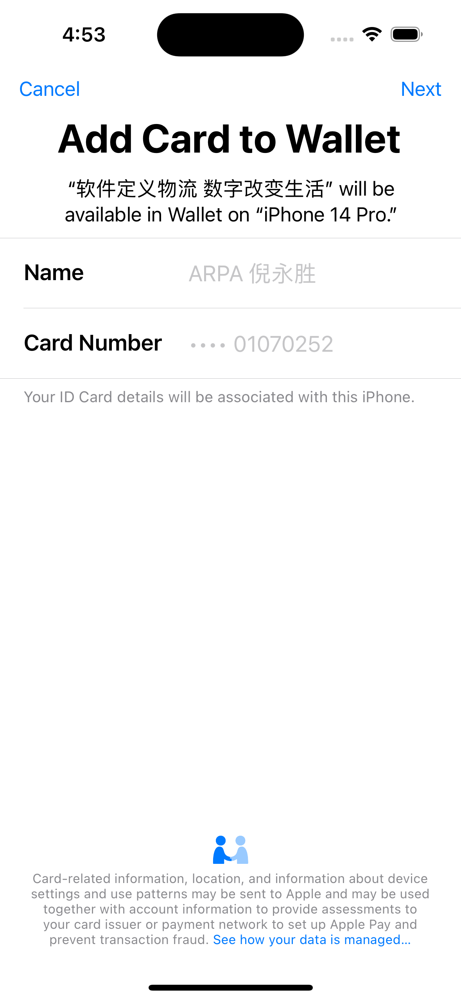

PassKitExample
===

===
> NFC读取、写入、虚拟卡片写入钱包实例；

## Screenshot:
APP | Write Card | Add Pass
------------ | ------------- | -------------
 |  | 


## Document:
#### 钱包写入NFC卡片
```xml
<!-- entitlements文件添加权限 -->
<!-- 有资质的话可申请 apple-pay-inquiries@apple.com -->
<key>com.apple.developer.payment-pass-provisioning</key>
<true/>
```

#### 虚拟卡片写入
```shell
// 1、修改.pkpass为.zip 修改pass.json

// 2、manifest.json文件校验
openssl sha1 <file>

// 3、生成signature文件
walletCard.p12 123456
openssl pkcs12 -in walletCard.p12 -clcerts -nokeys -out walletCard.pem -passin pass:123456
openssl pkcs12 -in walletCard.p12 -nocerts -out walletCardKey.pem -passin pass:123456 -passout pass:123456

openssl smime -binary -sign -certfile AWDRCA.pem -signer walletCard.pem -inkey walletCardKey.pem -in manifest.json -out signature -outform DER

// 4、打包walletCard.pkpass
zip -r walletCard.pkpass manifest.json pass.json signature logo.png icon.png strip.png
```
## Reference:
https://developer.apple.com/documentation/passkit/pkaddpaymentpassrequest?language=objc
https://blog.csdn.net/sz_vcp2007/article/details/60762349

## Contact Me [:octocat:](https://niyongsheng.github.io)
* E-mail: niyongsheng@Outlook.com
* Weibo: [@Ni永胜](https://weibo.com/u/7317805089)
